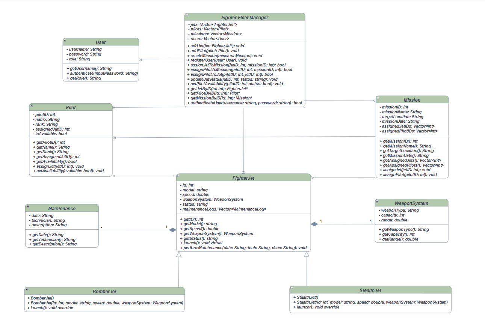
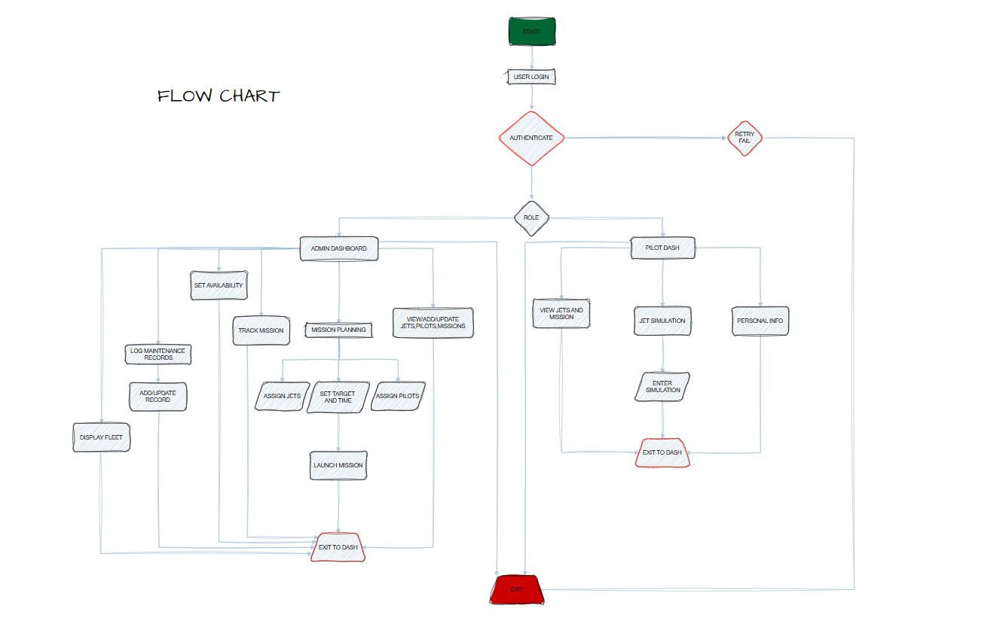

# 🛩️ Fighter Fleet Management System

A **C++ Object-Oriented Programming (OOP)** project simulating the control and management of a military fighter fleet. This system supports fighter jet management, pilot assignments, mission planning, 2D jet movement simulation, and is ready for **SFML integration** for future graphical enhancements.

---

## 📦 Features

### 🧠 Object-Oriented Principles
- **Abstraction**: Core jet behavior through abstract classes.
- **Inheritance**: Base class `FighterJet` extended by `StealthJet`, `BomberJet`.
- **Polymorphism**: Jet operations like `launch()` handled via virtual methods.
- **Encapsulation**: Proper class design for `Jet`, `Pilot`, `Mission`, `User`.

### ⚙️ Core Functionalities
- Add and manage jets with specific types.
- Assign and track pilots with availability.
- Plan missions with multiple jets and pilots.
- Log maintenance records per jet.
- Simulate 2D movement on a virtual grid.
- Role-based access system (Admin / User).

---

## 📊 UML Diagram

Visual representation of class relationships and structure.

> 🛠️ Created using [draw.io](https://draw.io)

---

## 🧭 Application Workflow

### 🔐 1. User Authentication
- Inputs: Username & Password
- Verifies role and redirects accordingly

### 🖥️ 2. Role-Based Dashboard
#### Admin:
- Manage Jets, Pilots, Missions
- Control Simulation, Maintenance Logs
#### User:
- View assigned jets and missions
- Launch authorized jets

### ✈️ 3. Jet Management
- Add jets (`Stealth`, `Bomber`)
- Launch / Assign / Track Status
- View maintenance log

### 👨‍✈️ 4. Pilot Management
- Add pilots
- Assign to jets
- Mark availability
- View logs

### 📅 5. Mission Planning
- Create missions with details
- Assign pilots and jets
- Track mission objectives and scheduling

### 🛠️ 6. Maintenance Logs
- Log repairs / issues
- Mark jets as grounded or operational
- View full history

### 🎮 7. Movement Simulation (SFML Ready)
- Control jet movement on a 2D grid:
  - `moveForward()`
  - `moveBackward()`
  - `moveLeft()`
  - `moveRight()`
- Real-time simulation via graphics (planned)

---

## 🔐 User Roles

| Role   | Capabilities                                             |
|--------|----------------------------------------------------------|
| Admin  | Full access (create/edit/delete jets, pilots, missions) |
| User   | View & launch assigned jets                              |

---

## 🔄 Flowchart: System Logic

A detailed activity flowchart of login, role access, operations, and simulation.

> 🛠️ Designed with [draw.io](https://draw.io)

---

## 🧰 Tools

- **Language**: C++
- **Graphics**: [SFML](https://www.sfml-dev.org/) (Planned)
- **Diagram Design**: [draw.io](https://draw.io)

---

## 📈 Planned Enhancements

- 🔲 **Graphical Simulation** using SFML
- 💾 **Persistent Data Handling** (file I/O or DB)
- 🧑‍💻 **GUI Interface** for login and dashboards
- 📤 Export mission/pilot logs to external files

---

## 📂 Diagram Source Links

View and edit the diagrams directly on draw.io:

- [📌 UML Diagram](https://viewer.diagrams.net/?tags=%7B%7D&highlight=0000ff&nav=1&title=uml.drawio#Uhttps%3A%2F%2Fraw.githubusercontent.com%2Fsobansaadi%2FSoban-oop-project%2Fmain%2Fuml.drawio)
- [📌 Flow Chart](https://viewer.diagrams.net/?tags=%7B%7D&highlight=0000ff&nav=1&title=flowchart.drawio#Uhttps%3A%2F%2Fraw.githubusercontent.com%2Fsobansaadi%2FSoban-oop-project%2Fmain%2Fflowchart.drawio)

---

## 🙌 Acknowledgements

This project is part of the C++ OOP coursework, showcasing real-world implementation of software design patterns, modular architecture, and simulation-ready features.

---
